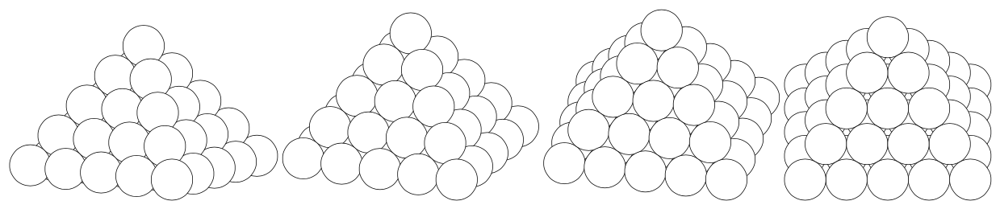

# Exposé Empilements de sphères (2026-04-02, Séminaire du magistère de mathématiques de Nancy)

Ce repo contient:

- les slides en pdf (expose-2026-04-02.pdf), 
- les références (articles en pdf ou pages web sauvegardées)
- les fichiers latex pour produire les illustrations des slides de l'exposé.

Lien pour téléchargement direct des slides : 
https://raw.githubusercontent.com/dmegy/expose-empilements-spheres-magistere-2026/refs/heads/main/expose-2026-04-02.pdf